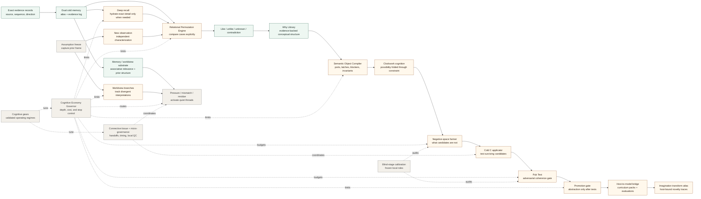

# Project Leviathan

Project Leviathan is a public architecture and experimental specification
bundle for a host-side memory, reasoning, and abstraction system.

This repository exists to publish and preserve the Project Leviathan documents
as timestamped reference material in the commons under the GNU Affero General
Public License version 3.0.

See `RELEASE.md` for the human-readable public release marker.

It is not an implementation repository. Prototype systems, experiments,
libraries, applications, or product builds derived from these specifications
should live in their own separate repositories.

## Purpose

The purpose of this repository is to make the Leviathan architecture available
for:

- public study;
- citation and attribution;
- critique and revision;
- AGPLv3-governed reuse;
- derivative research and implementation work;
- preservation of the original specification set.

## Core Idea

Leviathan treats cognition as an auditable host process rather than a single
model response.

Terminology boundary: in this repository, cognition, memory, worldview,
metacognition, and reasoning language refers to proposed host-side architecture
for preserving evidence, controlling retrieval, comparing interpretations, and
testing abstractions. It is not a claim of model consciousness, sentience,
personhood, subjective experience, or self-owned truth.

The system should be able to:

- preserve exact evidence separately from summaries;
- retrieve broad context cheaply and exact detail only when needed;
- assimilate observations into evidence-backed Why structures;
- compare cases through explicit relational vectors;
- record likeness, difference, uncertainty, and contradiction;
- freeze assumptions before new evidence is interpreted;
- track worldview-dependent conclusions without rewriting history;
- prevent unnecessary recursive analysis;
- compile granular semantic material into persistent, manipulable objects;
- coordinate bounded reasoning stages through host-owned connective tissue;
- farm negative space, apply surviving candidates, and adversarially test them;
- calibrate task-fit reasoning regimes rather than assume one universal mode;
- generate bounded imagined constructs from host-traceable source material;
- promote only tested, traceable abstractions.

The guiding principle is simple:

```text
Evidence first.
Comparison second.
Abstraction only when earned.
```

## Architecture Map

This map gives the high-level shape before the documents below. It is a
conceptual flow, not an implementation dependency graph.



## Documents

The repository contains the original core specification set plus later
extension notes that refine coordination, calibration, bounded imagination, and
candidate testing.

Local terminology for this repository is summarized in `GLOSSARY.md`.

### Relational Permutation Engine

File: `RELATIONAL_PERMUTATION_ENGINE.md`

Defines a host-level mechanism for producing new relational knowledge from
known concrete cases. It proposes holding cases together, rotating them through
comparison vectors, recording like/unlike/unknown/contradiction outputs, sorting
those records geometrically, and promoting only abstractions that survive
pressure testing.

### Dual Cold Memory and Deep Recall

File: `DUAL_COLD_MEMORY_AND_DEEP_RECALL.md`

Defines a two-layer cold memory architecture:

- a searchable cold atlas of compressed summaries and relations;
- a cold evidence log containing exact source records.

The atlas helps the system find relevant history cheaply. Deep recall hydrates
exact evidence only when the task requires attribution, order, directionality,
or auditability.

### Semantic Assimilation and Why Library

File: `SEMANTIC_ASSIMILATION_AND_WHY_LIBRARY.md`

Defines how repeated observations become accumulated, multilevel,
evidence-backed conceptual knowledge. It describes how observations are
characterised, compared, sorted into semantic Why structures, provisionally
placed under supported parent concepts, kept out of unsupported child concepts,
and preserved as residue when they do not yet fit.

### Semantic Object Compiler

File: `SEMANTIC_OBJECT_COMPILER.md`

Defines a proposed host-governed compiler that turns granular snippets,
relations, and semantic clusters into persistent, modular, inspectable objects.
It introduces ports, gear teeth, latch conditions, blockers, tolerances,
invariants, uncertainty markers, and provenance hatches so higher-order
reasoning can manipulate structured semantic objects rather than repeatedly
rebuilding meaning from fragments.

### Assumption Freeze and Worldview Branching

File: `ASSUMPTION_FREEZE_AND_WORLDVIEW_BRANCHING.md`

Defines a mechanism for freezing prior assumptions before a new observation is
interpreted. This allows the system to compare what it expected against what
the evidence later supported, making bias, presupposition, worldview drift, and
post-hoc rationalisation inspectable.

### Cognitive Economy Governor

File: `COGNITIVE_ECONOMY_GOVERNOR.md`

Defines a host-owned control layer for deciding how much reasoning is justified.
The governor limits depth, memory descent, permutation count, EF retries,
worldview branching, and operator-facing explanation. It is designed to prevent
recursive over-analysis while preserving honesty and unresolved evidence.

### Host-to-Model Relational Abstraction Bridge

File: `HOST_TO_MODEL_RELATIONAL_ABSTRACTION_BRIDGE.md`

Defines how host-earned relational structures could be turned into curriculum
packs, training examples, and evaluation batteries. It distinguishes
host-supported abstraction from model-internalised abstraction and proposes
tests for transfer, boundary detection, false analogy rejection, calibration,
and tool discipline.

### Withheld-C Base Corpus Protocol

File: `WITHHELD_C_BASE_CORPUS_PROTOCOL.md`

Defines the controlled experimental primitive for testing whether a model can
derive a withheld conclusion C from grounded A and B premises. It covers domain
competence calibration, contamination audits, synthetic microdomains, distance
manipulation, outcome classes, and the distinction between honest gap
recognition and unsupported completion.

### Project Leviathan Cognitive Cartography

File: `LEVIATHAN_COGNITIVE_CARTOGRAPHY.md`

Defines a mapping programme for measuring what novel territory a model can
reach from known relational structure, at what cost and reliability. It treats
verified derivations as landmarks and tracks threadhopping, bridge cost,
productive depth, launch points, dead ends, and hallucination cliffs.

### Topological Triangulation and the Lighthouse Model

File: `TOPOLOGICAL_TRIANGULATION_AND_THE_LIGHTHOUSE_MODEL.md`

Develops the lighthouse metaphor for cognitive cartography: a verified
withheld-C derivation is a survey peg rather than a complete map. Repeated,
independent, evidence-checked arrivals let the host infer hidden cognitive
topology without promoting plausible but unverified conclusions.

### Cognitive Topology and the Meshing Gears Hypothesis

File: `COGNITIVE_TOPOLOGY_MESHING_GEARS_HYPOTHESIS.md`

Proposes that compatibility between learned relational structures can be
measured as topology: direct and directional transfer, bridge cost,
intermediate representations, compound assistance, slippage, and cumulative
propagation. The gear metaphor remains subordinate to empirical measurement.

### Cross-Domain Relational Affordance Map

File: `CROSS_DOMAIN_RELATIONAL_AFFORDANCE_MAP.md`

Defines a research lane for measuring which learned domains act as enabling
machinery for withheld-C derivations in other domains. It models assistance as
directed, potentially higher-order relationships rather than assuming that
transfer is symmetric or universally useful.

### Beyond Withheld C Toward General Cognitive Cartography

File: `BEYOND_WITHHELD_C_TOWARD_GENERAL_COGNITIVE_CARTOGRAPHY.md`

Extends the withheld-C method cautiously beyond deduction toward other
measurable cognitive transitions, including analogy, generalisation, causal
inference, category formation, contradiction detection, assumption revision,
salience selection, missing-structure recognition, and intermediate-concept
construction.

### Memory, Worldview, and the Booper Hypothesis

File: `MEMORY_WORLDVIEW_AND_BOOPER_HYPOTHESIS.md`

Defines an exploratory link between layered memory, worldview formation,
gut-instinct-like nudges, and the fast primitives that may shape A+B=C
candidate emergence before explicit recall or analysis.

### Leviathan Boopers as Gap-Response Operators

Files: `leviathan_booper_gap_response_hypothesis.md` and
`leviathan_booper_gap_response_hypothesis.docx`

Preserves a hypothesis, arising from Project Mímir, that a booper may be a
local gap-response operator. Rather than merely adding another reasoning step,
it detects insufficiently supported representational geometry, characterises
the void, and selects or routes a bounded response such as evidence retrieval,
representation shift, decomposition, rerouting, escalation, or preservation
of an explicit unknown.

### Clockwork Cognition Core

File: `CLOCKWORK_COGNITION_CORE.md`

Defines the clockwork cognition hypothesis: the model supplies positive
possibility space, the host supplies durable constraints and negative geometry,
and useful C candidates are what survive bounded work, checking, rerouting, and
promotion.

### Leviathan Negative-Space Farming and Pub Test

File: `LEVIATHAN_NEGATIVE_SPACE_FARMING_AND_PUB_TEST.md`

Defines a staged candidate-discovery and evaluation loop: pressure activates
threads, mutations reveal what the answer is not, surviving C candidates are
applied back to the source problem, and an independent Pub Test attacks them
before promotion.

### Leviathan Connective Tissue and Micro-Governance

File: `LEVIATHAN_CONNECTIVE_TISSUE_AND_MICRO_GOVERNANCE.md`

Defines the handoff, timing, activation, resource pressure, local
quality-control, and micro-governance layer that lets the larger Leviathan
subsystems behave as one coordinated host process.

### Leviathan Cognitive Gears and Tuning-Fork Calibration

File: `LEVIATHAN_COGNITIVE_GEARS_AND_TUNING_FORK_CALIBRATION.md`

Defines the hypothesis that Leviathan needs validated task-fit operating
regimes rather than one universal configuration, and proposes calibration
models and controlled worlds for mapping gear boundaries.

### Leviathan Blind-Stage Reasoning and Controlled Novelty Calibration

File: `LEVIATHAN_BLIND_STAGE_REASONING_AND_CONTROLLED_NOVELTY_CALIBRATION.md`

Defines a frozen, blind, multicellular reasoning architecture in which each
stage sees only its local role, input, budget, and output schema, allowing
system-internal novelty claims to be audited through controlled calibration
runs.

### Imagination Transform Atlas and Learning-Law Probes

File: `IMAGINATION_TRANSFORM_ATLAS_AND_LEARNING_LAW_PROBES.md`

Defines bounded imagination as host-traceable construction rather than answer
retrieval, with transform records that compare prior host knowledge, relational
operations, emergent constructs, and repeated learning-law patterns.

### Clockwork Cognition Biological Parallel

File: `CLOCKWORK_COGNITION_BIOLOGICAL_PARALLEL.md`

Compares Clockwork Cognition with a contemporary brain-wave control theory at
the level of functional silhouette, while preserving the boundary between
biological mechanism and explicit host architecture.

## Suggested Reading Order

1. `RELATIONAL_PERMUTATION_ENGINE.md`
2. `DUAL_COLD_MEMORY_AND_DEEP_RECALL.md`
3. `SEMANTIC_ASSIMILATION_AND_WHY_LIBRARY.md`
4. `SEMANTIC_OBJECT_COMPILER.md`
5. `ASSUMPTION_FREEZE_AND_WORLDVIEW_BRANCHING.md`
6. `COGNITIVE_ECONOMY_GOVERNOR.md`
7. `HOST_TO_MODEL_RELATIONAL_ABSTRACTION_BRIDGE.md`
8. `WITHHELD_C_BASE_CORPUS_PROTOCOL.md`
9. `LEVIATHAN_COGNITIVE_CARTOGRAPHY.md`
10. `TOPOLOGICAL_TRIANGULATION_AND_THE_LIGHTHOUSE_MODEL.md`
11. `COGNITIVE_TOPOLOGY_MESHING_GEARS_HYPOTHESIS.md`
12. `CROSS_DOMAIN_RELATIONAL_AFFORDANCE_MAP.md`
13. `BEYOND_WITHHELD_C_TOWARD_GENERAL_COGNITIVE_CARTOGRAPHY.md`
14. `MEMORY_WORLDVIEW_AND_BOOPER_HYPOTHESIS.md`
15. `leviathan_booper_gap_response_hypothesis.md`
16. `CLOCKWORK_COGNITION_CORE.md`
17. `LEVIATHAN_NEGATIVE_SPACE_FARMING_AND_PUB_TEST.md`
18. `LEVIATHAN_CONNECTIVE_TISSUE_AND_MICRO_GOVERNANCE.md`
19. `LEVIATHAN_COGNITIVE_GEARS_AND_TUNING_FORK_CALIBRATION.md`
20. `LEVIATHAN_BLIND_STAGE_REASONING_AND_CONTROLLED_NOVELTY_CALIBRATION.md`
21. `IMAGINATION_TRANSFORM_ATLAS_AND_LEARNING_LAW_PROBES.md`
22. `CLOCKWORK_COGNITION_BIOLOGICAL_PARALLEL.md`

This order starts with the core comparison engine, then adds memory, concept
assimilation, compiled semantic objects, temporal integrity, depth control, and
the training/evaluation bridge. The later documents then develop worldview
substrate, a controlled withheld-C probe, cognitive cartography, triangulation,
measured transfer and cross-domain assistance, gap-response control, clockwork
constraint mechanics, negative-space testing, host connective tissue,
operating-regime calibration, blind-stage novelty audits, bounded imagination,
and biological comparison notes.

## Repository Boundary

This repository is intentionally document-only.

It should contain the Project Leviathan architecture specifications, licensing
material, and lightweight repository documentation only.

Implementation work should be developed elsewhere so the public specification
record remains clear, stable, and easy to inspect.

Possible future implementation repositories may include:

- memory record prototypes;
- relational permutation test chambers;
- semantic object compiler experiments;
- assumption-freeze audit tools;
- cognitive-governor experiments;
- curriculum or evaluation generators;
- Chatty-Cog or ChattyFactory integration surfaces.

Those builds may cite or derive from this repository, but they should not turn
this repository into an application scaffold.

## Licensing

Project Leviathan is licensed under the GNU Affero General Public License
version 3.0.

See `LICENSE` for the full AGPLv3 license text.

The AGPLv3 is a strong copyleft license. If this project is modified and made
available to users over a network, the modified source code must also be made
available under the license terms.

## Status

Working architecture, hypothesis, and experimental specification set.

The documents are intended to be read, cited, challenged, revised, and used as
the basis for separate AGPLv3-compatible research or implementation work.
