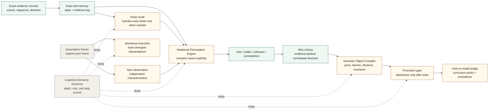

# Project Leviathan

Project Leviathan is a public architecture and experimental specification
bundle for a host-side memory, reasoning, and abstraction system.

This repository exists to publish and preserve the Project Leviathan documents
as timestamped reference material in the commons under the GNU Affero General
Public License version 3.0.

See `RELEASE.md` for the human-readable public release marker.

It is not an implementation repository. Prototype systems, experiments,
libraries, applications, or product builds derived from these specifications
should live in their own separate repositories.

## Purpose

The purpose of this repository is to make the Leviathan architecture available
for:

- public study;
- citation and attribution;
- critique and revision;
- AGPLv3-governed reuse;
- derivative research and implementation work;
- preservation of the original specification set.

## Core Idea

Leviathan treats cognition as an auditable host process rather than a single
model response.

The system should be able to:

- preserve exact evidence separately from summaries;
- retrieve broad context cheaply and exact detail only when needed;
- assimilate observations into evidence-backed Why structures;
- compare cases through explicit relational vectors;
- record likeness, difference, uncertainty, and contradiction;
- freeze assumptions before new evidence is interpreted;
- track worldview-dependent conclusions without rewriting history;
- prevent unnecessary recursive analysis;
- compile granular semantic material into persistent, manipulable objects;
- promote only tested, traceable abstractions.

The guiding principle is simple:

```text
Evidence first.
Comparison second.
Abstraction only when earned.
```

## Architecture Map

This map gives the high-level shape before the six documents below. It is a
conceptual flow, not an implementation dependency graph.



## Documents

The core specification set contains seven architecture documents.

Local terminology for this repository is summarized in `GLOSSARY.md`.

### Relational Permutation Engine

File: `RELATIONAL_PERMUTATION_ENGINE.md`

Defines a host-level mechanism for producing new relational knowledge from
known concrete cases. It proposes holding cases together, rotating them through
comparison vectors, recording like/unlike/unknown/contradiction outputs, sorting
those records geometrically, and promoting only abstractions that survive
pressure testing.

### Dual Cold Memory and Deep Recall

File: `DUAL_COLD_MEMORY_AND_DEEP_RECALL.md`

Defines a two-layer cold memory architecture:

- a searchable cold atlas of compressed summaries and relations;
- a cold evidence log containing exact source records.

The atlas helps the system find relevant history cheaply. Deep recall hydrates
exact evidence only when the task requires attribution, order, directionality,
or auditability.

### Semantic Assimilation and Why Library

File: `SEMANTIC_ASSIMILATION_AND_WHY_LIBRARY.md`

Defines how repeated observations become accumulated, multilevel,
evidence-backed conceptual knowledge. It describes how observations are
characterised, compared, sorted into semantic Why structures, provisionally
placed under supported parent concepts, kept out of unsupported child concepts,
and preserved as residue when they do not yet fit.

### Semantic Object Compiler

File: `SEMANTIC_OBJECT_COMPILER.md`

Defines a proposed host-governed compiler that turns granular snippets,
relations, and semantic clusters into persistent, modular, inspectable objects.
It introduces ports, gear teeth, latch conditions, blockers, tolerances,
invariants, uncertainty markers, and provenance hatches so higher-order
reasoning can manipulate structured semantic objects rather than repeatedly
rebuilding meaning from fragments.

### Assumption Freeze and Worldview Branching

File: `ASSUMPTION_FREEZE_AND_WORLDVIEW_BRANCHING.md`

Defines a mechanism for freezing prior assumptions before a new observation is
interpreted. This allows the system to compare what it expected against what
the evidence later supported, making bias, presupposition, worldview drift, and
post-hoc rationalisation inspectable.

### Cognitive Economy Governor

File: `COGNITIVE_ECONOMY_GOVERNOR.md`

Defines a host-owned control layer for deciding how much reasoning is justified.
The governor limits depth, memory descent, permutation count, EF retries,
worldview branching, and operator-facing explanation. It is designed to prevent
recursive over-analysis while preserving honesty and unresolved evidence.

### Host-to-Model Relational Abstraction Bridge

File: `HOST_TO_MODEL_RELATIONAL_ABSTRACTION_BRIDGE.md`

Defines how host-earned relational structures could be turned into curriculum
packs, training examples, and evaluation batteries. It distinguishes
host-supported abstraction from model-internalised abstraction and proposes
tests for transfer, boundary detection, false analogy rejection, calibration,
and tool discipline.

## Suggested Reading Order

1. `RELATIONAL_PERMUTATION_ENGINE.md`
2. `DUAL_COLD_MEMORY_AND_DEEP_RECALL.md`
3. `SEMANTIC_ASSIMILATION_AND_WHY_LIBRARY.md`
4. `SEMANTIC_OBJECT_COMPILER.md`
5. `ASSUMPTION_FREEZE_AND_WORLDVIEW_BRANCHING.md`
6. `COGNITIVE_ECONOMY_GOVERNOR.md`
7. `HOST_TO_MODEL_RELATIONAL_ABSTRACTION_BRIDGE.md`

This order starts with the core comparison engine, then adds memory, concept
assimilation, compiled semantic objects, temporal integrity, depth control, and
finally the training/evaluation bridge.

## Repository Boundary

This repository is intentionally document-only.

It should contain the Project Leviathan architecture specifications, licensing
material, and lightweight repository documentation only.

Implementation work should be developed elsewhere so the public specification
record remains clear, stable, and easy to inspect.

Possible future implementation repositories may include:

- memory record prototypes;
- relational permutation test chambers;
- semantic object compiler experiments;
- assumption-freeze audit tools;
- cognitive-governor experiments;
- curriculum or evaluation generators;
- Chatty-Cog or ChattyFactory integration surfaces.

Those builds may cite or derive from this repository, but they should not turn
this repository into an application scaffold.

## Licensing

Project Leviathan is licensed under the GNU Affero General Public License
version 3.0.

See `LICENSE` for the full AGPLv3 license text.

The AGPLv3 is a strong copyleft license. If this project is modified and made
available to users over a network, the modified source code must also be made
available under the license terms.

## Status

Working architecture, hypothesis, and experimental specification set.

The documents are intended to be read, cited, challenged, revised, and used as
the basis for separate AGPLv3-compatible research or implementation work.
